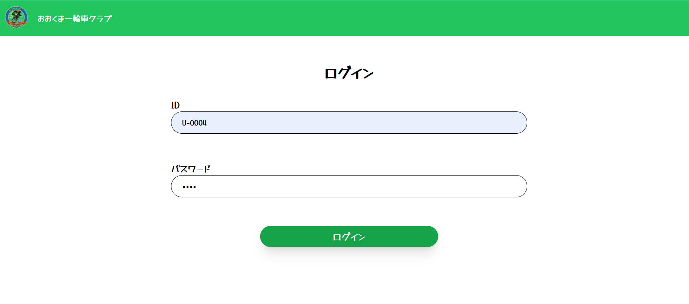
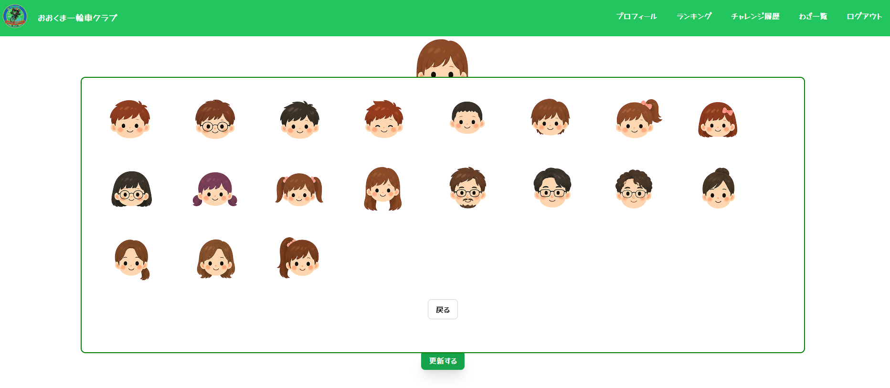
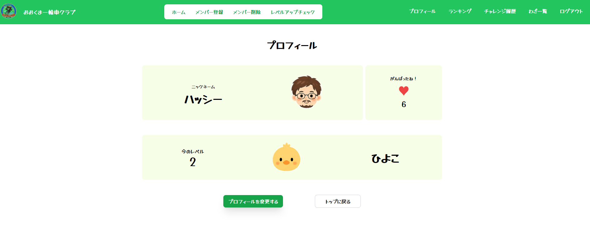
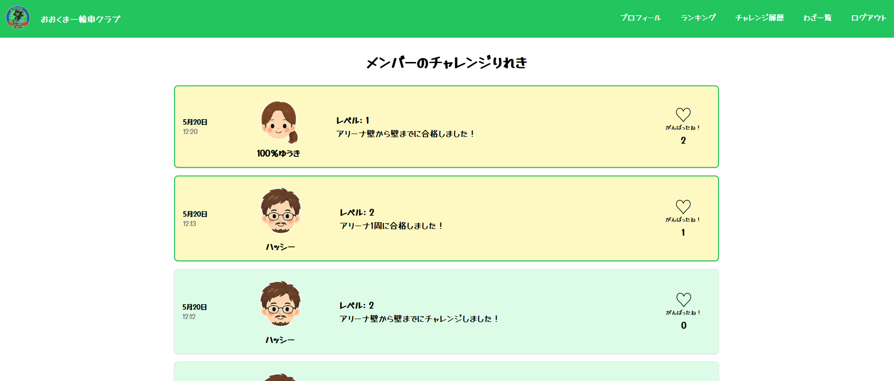
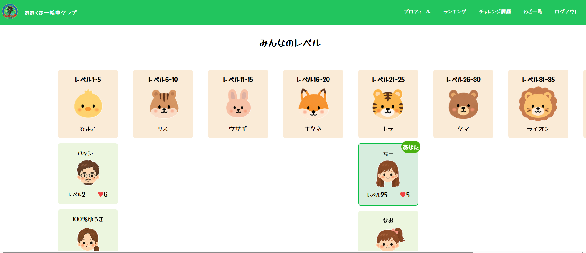
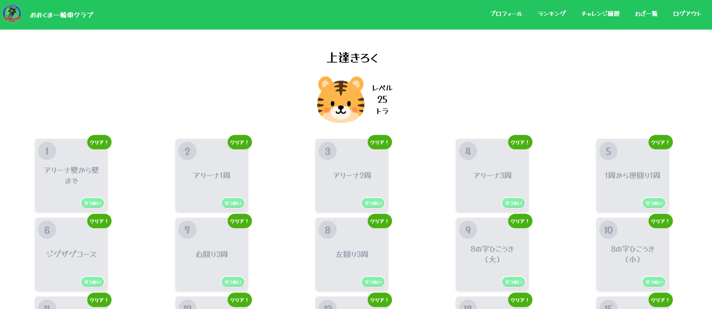
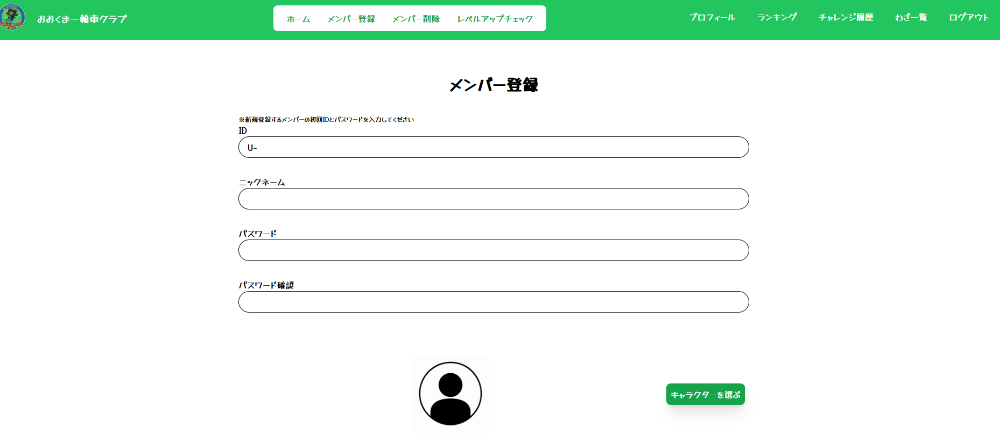
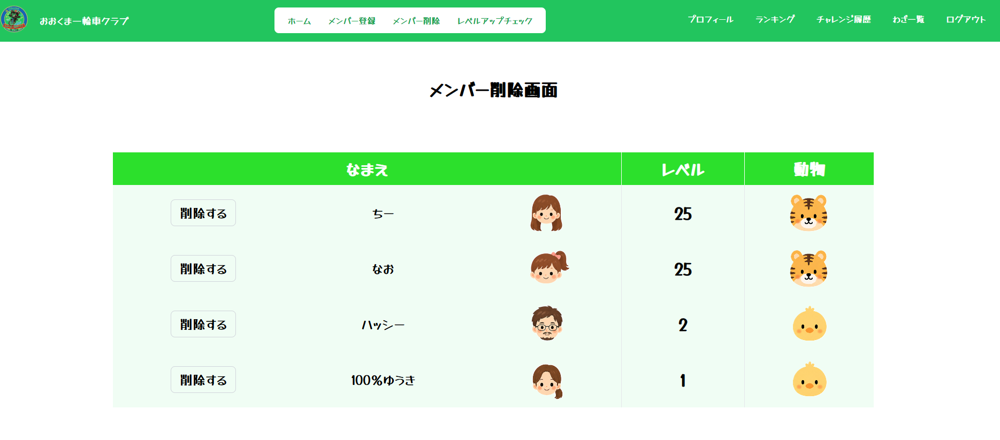
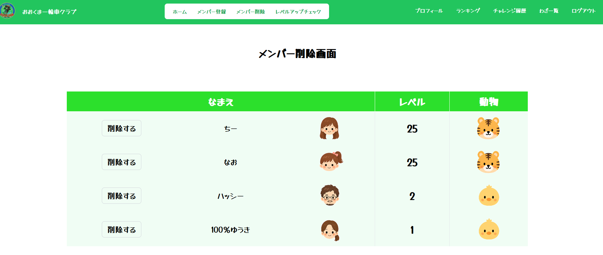

# 一輪車レベルアップアプリ

# **「Uni-mal（ユニマル）」**

## 解説

このアプリは一輪車を練習している大人、子供たちがより楽しくスキルを習得するために開発したアプリである。
挫折しやすい技の習得を自分だけでなくメンバーからの応援をもらいながら達成に導き、自分の成長度合いも可視化することで継続的な練習意欲の維持を目指す。
一輪車の「Unicycle」と技のレベルを動物ランクで表示する「Animal」を合わせてアプリ名を設定。

---

## 環境構築

- git clone git@github.com:yoichi-hashimoto/unicycle-app.git
- cd src
- cp .env.example .env
- docker compose up -d
- composer install
- php artisan key:generate
- php artisan migrate --seed

---

## 機能

- ユーザーログイン機能
- プロフィール変更機能
- 技の一覧表示機能
- メンバーランキング機能
- メンバーチャレンジ表示機能
- 「ハートマーク」による応援機能
- 管理者機能
  - 新規登録機能
  - ユーザー削除機能
  - レベルアップ判定

---

## 使用技術

- Laravel 8.4
- Fortify
- HTML/CSS
- JavaScript
- tailwind-css
- Docker/composer
- nginx

---

## 開発期間

- 2026年4月1日～5月31日
- 1週間に10時間程度を使い作成

## ER図

## 背景

#### 娘が学校で一輪車に熱中したことをきっかけに、地域で一輪車クラブを立ち上げることになった。集客、講師の招聘、会計、補助金の申請、会場予約など事務的な面でクラブの立ち上げをサポートしている中で作者も一輪車に挑戦している。

#### 一輪車はまず乗れることが第一優先となるが乗れてしまって満足するケースが多い。だが、一輪車の技術は回転したりジャンプしたり、団体競技をしたりと多岐に渡り、技術習得の奥が深いがあまり知られていない。

#### 一方で、どうしても個人練習の色合いが強く、だれがどんなレベルの技が出来るか分からなかったり、何を練習しているかも分からない。そのため練習メニューやチーム編成にも苦労することが多い。

## 機能解説

#### 前述した背景を楽しく継続して解消できるような機能を付けた。

1. ログイン機能
   

- 入会時に配布された領収書に書かれているIDおよびパスワードを入力することでログインが可能となる。1ユーザーにつき1ID発行とし、新規登録は会費支払いをもって管理者が行う。
- 以後の機能はログインユーザーのみ使用可能。

---

2. プロフィール更新機能
   

- 自身の到達しているレベル、アバター、ニックネームを編集することが出来る。ここでパスワードも変更可能。
- アバターは19種類のイラストから選択が可能となっており、男の子、女の子、大人の男女から選択することが出来る。

---

3. レベル表示機能
   

- 1～25レベルまで設定されており、クリアするごとにレベルアップする。
- 5レベルごとに動物のアバターが設定されており、自分のレベル感を動物で愛着を持ちながら実感でき、次の目標にもなる。

---

4. チャレンジ履歴
   

- わざ取得に向けたテストを受けることが出来る。管理者が3回成功と判断した時点で合格となり、次のレベルに進む。3回合格できなかった場合は失敗となる。
- チャレンジは成否にかかわらず、データベースに保存され、「チャレンジ履歴」からメンバー全員のチャレンジを確認できる。
- ❤ボタンを押すことでメンバーのチャレンジ、レベルアップを応援することが出来るようになっており、レベルを問わずチャレンジ回数が多いほど❤を得られる仕組みになっている。

---

5. ランキング機能
   

- 登録しているメンバー全員の動物ランクが分かるようになっている。誰がどのレベルなのかが一覧でわかる。
- メンバーが取得した❤数を表示できるため、レベルだけでなく、メンバー同士のがんばりや応援度合いも把握できる。

---

6. わざ一覧表示
   

- 一輪車に乗れるようになるまでから、さらに上級の技までを一覧表示。クリアしたわざには「クリア表示がつく」
- 　せつめいボタンを押すと、練習方法や成功するためのコツを読むことが出来る。
- 動画ボタンを押すと、実際のわざを動画で見ることが出来る。

---

7. 管理者機能
   

- メンバー登録は管理者のみが出来る。リアルでの会費支払いと連動してメンバー作成となる。
  
- 退会や卒業等で除名となった会員の削除を行う。

  

- レベルアップテストを受講したメンバーのレベルアップ判定を行う。3回成功した場合は合格となり、チャレンジ失敗の場合は失敗となり、履歴が残り❤ボタンの対象となる。

## 工夫した点

### 1. 継続モチベーションを重視した設計

一輪車は技の習得難易度が高く、途中で挫折するケースが多い。
そのため「レベル表示」「動物ランク」「❤による応援機能」を実装し、
他メンバーから応援されながら継続できる設計を意識した。

### 2. 子供でも直感的に使えるUI

小学生でも操作できるよう、
文字だけでなく動物やアバターを多く使用し、
視覚的に理解しやすいデザインを意識した。

### 3. 管理者の運営負荷軽減

クラブ運営では誰がどのレベルか把握するのが難しかったため、
ランキング機能やチャレンジ履歴機能を実装し、
指導やチーム編成を行いやすくした。

## 苦労した点

### 1. リレーション設計

ユーザー、チャレンジ履歴、技、Like機能など
複数テーブルが関連するため、
Eloquentのリレーション設計に苦労した。

### 2. UI状態管理

モーダル表示やアバター切り替え、
Likeボタンの状態変化など、
JavaScriptとBladeの連携実装に苦労した。

### 3. モチベーション設計

単なる技記録アプリでは継続しにくいと考え、
「応援される仕組み」をどのように実装するかを何度も改善した。

## 今後の展望

- Reactを使用したSPA化
- レベルアップ履歴を可しかできる個人グラフ
- 動画投稿機能（大会演技の共有）
- クラブ単位で管理できるマルチチーム対応
